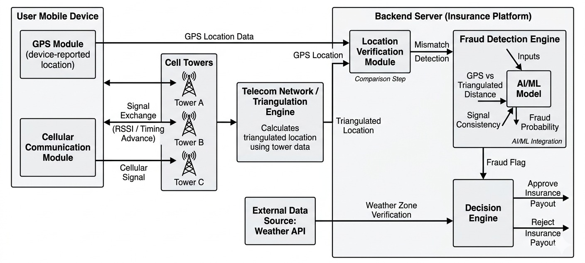

# 🛡️ SignalArmor: The Physical Verification Layer
**Secure, Physics-Backed Location Validation for the Telematics Industry.**

## 1. Requirement & Persona Scenarios
**Core Problem:** Current location-based services rely on GPS, which is easily spoofed via "Mock Location" APIs and coordinated via Telegram bots. **SignalArmor** shifts the "Source of Truth" from software-reported GPS to hardware-level **Cellular Triangulation**.

### Persona Scenarios:
* **The "Ghost Claimer" (Fraudster):** A user in a Telegram group spoofs their location to a high-payout zone (e.g., a "Safe Driving" zone) to lower their weekly insurance premium while actually being in a high-risk area.
* **The "Claims Adjuster" (Admin):** Needs to verify the physical presence of 5,000 concurrent users. They use SignalArmor’s **Risk Dashboard** to flag users whose GPS coordinates do not match their hardware "Timing Advance" (distance from cell tower).

### Workflow:

1.  **Passive Harvest:** App captures GPS, Cell ID, Neighboring Cells, and RTT (Round Trip Time).
2.  **The Handshake:** Data is sent to the **SignalArmor Engine**.
3.  **Cross-Verification:** The engine compares the GPS "claimed" location against the physical "broadcast sector" of the connected cell tower.
   

4.  **Risk Scoring:** A $P_{fraud}$ (Probability of Fraud) score is generated based on signal divergence.

---

## 2. Weekly Premium Model & Triggers
**The Model:** **"Proof-of-Presence" (PoP) Weekly Premium.**
Users pay a base rate. Every week, if they provide 40+ hours of "Verified Presence" (location data with a $<10\%$ fraud risk), they receive a 15% rebate on their next week’s premium.

### Parametric Triggers:
* **Trigger 1 (The Mismatch):** If $GPSLocation \notin CellSector$, insurance coverage is instantly paused for that session.
* **Trigger 2 (The Speed of Light):** If $NetworkLatency > 150ms$ while GPS is local, the session is flagged for VPN usage.
* **Trigger 3 (The Static Flag):** If GPS moves but Cell ID/Signal Strength remains 100% constant, the user is flagged for "Emulator Usage."

### Platform Choice: **Native Mobile (Android/iOS)**
* **Justification:** A Web platform cannot access the **Telephony Manager** or **IMU (Inertial Measurement Unit)** sensors. Native access is mandatory to bypass software spoofing and verify hardware-level cellular metadata (Cell ID, RSSI, and Neighbor Lists).

---

## 3. AI/ML Integration
### A. Premium Calculation (Dynamic Risk Pricing)
We use a **Random Forest Regressor** to adjust premiums. If a user’s "Signal Fingerprint" frequently fluctuates or shows "Impossible Travel" patterns, their weekly risk profile increases, automatically adjusting their premium in real-time.

### B. Fraud Detection (Graph Neural Networks - GNN)
* **Cluster Detection:** We use GNNs to analyze relationship graphs between users. If a cluster of 20 users shares identical movement patterns (Telegram-led raids), the AI identifies the bot-driven "Lead Account" and flags the entire "Digital Cell" simultaneously.
* **IMU Pattern Analysis:** A **Convolutional Neural Network (CNN)** analyzes accelerometer data to distinguish between "Natural Human Gait" and "Synthetic Jitter" injected by spoofing bots.

---

## 4. Tech Stack & Development Plan

| Layer | Technology |
| :--- | :--- |
| **Mobile** | Kotlin (Android) / Swift (iOS) for Native Radio API access. |
| **Backend** | Fast API (Python) for high-concurrency signal processing. |
| **Real-time Map** | Mapbox GL for visualizing "Signal Sectors" vs "GPS Pins." |
| **Database** | PostgreSQL + PostGIS (Geospatial analysis). |
| **AI/ML** | PyTorch for GNN-based cluster detection. |

### Development Plan:
* **Phase 1 (W1-2):** Develop "Signal Harvester" module to pull Cell ID and Timing Advance.
* **Phase 2 (W3):** Build the "Cross-Check" engine (GPS vs Sector logic).
* **Phase 3 (W4):** Integrate ML models for Behavioral and Cluster analysis.

---

## 5. The "SignalArmor" Advantage
Traditional fraud detection looks for *bad apps*. **SignalArmor looks for broken physics.** By integrating **Cell Triangulation** with **Network Latency** and **IMU Physics**, we create a three-dimensional "Verification Cage." To bypass SignalArmor, a fraudster wouldn't just need a better app—they would need to rebuild the city's cellular infrastructure.
